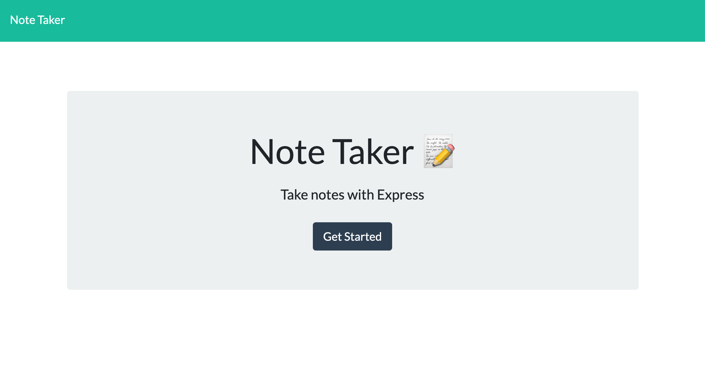
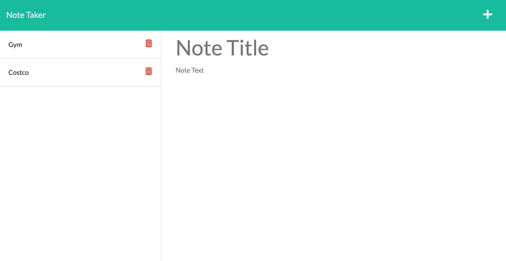

# express.js-note-taker

  
  ## Table of Contents
  - [Description](#description)
  - [Deployment](#installation)
  - [Usage](#usage)
  - [Screenshot](#screenshot)
  - [Tech Tools](#techtools)
  - [License](#license)
  - [Contact](#contact)

  ## Description
  With this application the user can write and save notes; organize thoughts and keep track of tasks needed to complete.
  
  ## Deployment
  [Click](https://agile-inlet-32626.herokuapp.com/) for deployed application. 
  ## Screenshot

  - 
  - 
  ## Tech Tools

  - [JavaScript](https://www.javascript.com)
  - [Heroku](https://www.heroku.com/home)
  - [Bootstrap](https://getbootstrap.com)
  - [Express](https://expressjs.com)
  - [Node.js](https://nodejs.org/en)
  - [NPM](https://www.npmjs.com)
  ## License
  MIT

 ## Contact:
  ShawnArgent (https://github.com/ShawnArgent)  
  kshawn001@gmail.com

